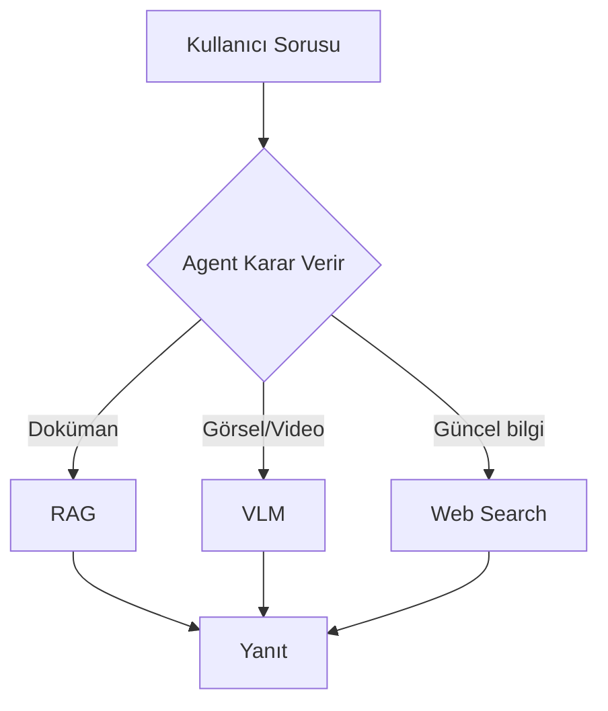

# Task 0.5 — Sistem Mimarisi

## Kullanıcı İsteği Akışı
(buraya adım adım akış yazılacak)

## Agent Workflow
(karar noktaları, tool seçimi mantığı)

## Kullanılan Bileşenler
- LLM:
- VLM:
- Vector DB:
- Web Search:
- Memory:

## Mermaid Diyagramı

