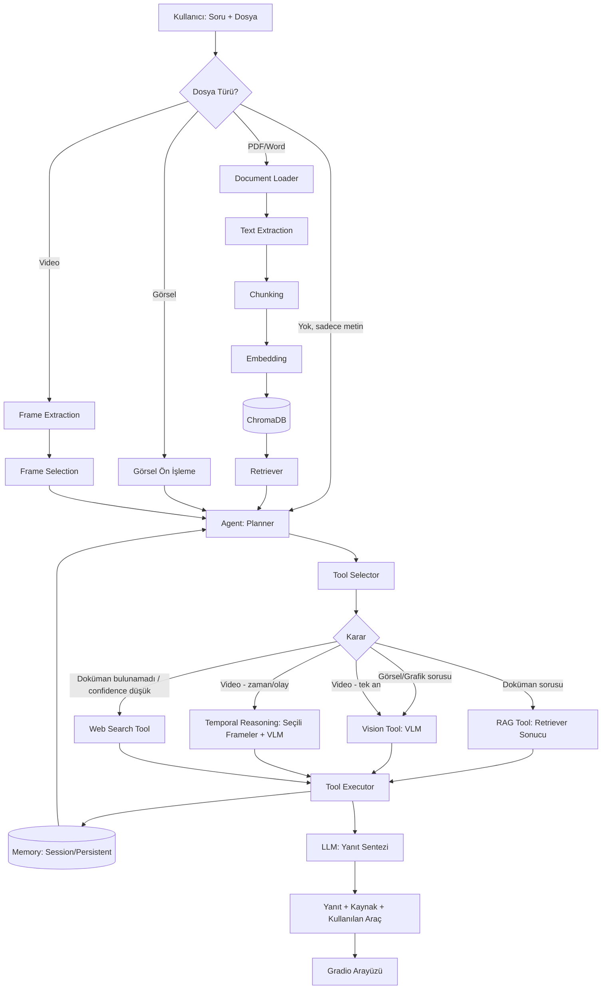

# Task 0.5 — Sistem Mimarisi

## 1. Kullanıcı İsteği Akışı (uçtan uca)

1. Kullanıcı arayüze (Gradio) bir girdi sağlar: metin sorusu + isteğe bağlı dosya (PDF/Word/görsel/video)
2. Dosya varsa, türüne göre ön işleme yapılır:
   - PDF/Word → **Document Loader** (PyMuPDF/python-docx) → **Text Extraction** → Chunking → Embedding → ChromaDB → **Retriever**
   - Görsel → doğrudan VLM'e iletilecek şekilde hazırlanır
   - Video → **Frame Extraction** (OpenCV) → **Frame Selection** (soruyla ilgili karelerin seçilmesi — tüm frame'ler gönderilmez)
3. Kullanıcının sorusu ve hazırlanan bağlam **Agent**'a (LangGraph orkestrasyonu) iletilir
4. Agent (Planner → Tool Selector → Tool Executor) hangi aracı/araçları kullanacağına karar verir
5. Seçilen araç(lar) çalıştırılır, sonuçlar toplanır; Memory bu süreçte Agent'a bağlam sağlar
6. LLM, toplanan bağlamı kullanarak nihai yanıtı (kaynak göstererek) üretir
7. Yanıt + kullanılan araç/kaynak bilgisi Gradio arayüzünde kullanıcıya gösterilir

## 2. Agent Workflow (karar noktaları)

```
Soru geldi
  ├─ Doküman/metin sorusu mu? → RAG Tool (Retriever sonucu + LLM)
  ├─ Görsel/grafik sorusu mu? → Vision Tool (VLM)
  ├─ Video ile ilgili mi?
  │     ├─ Tek an sorusu → seçili tek frame + VLM
  │     └─ Zaman/olay sorusu → Frame Selection ile seçilen çoklu frame + VLM + LLM (Temporal Reasoning)
  ├─ Güncel/harici bilgi mi gerekiyor? → Web Search Tool
  └─ Doküman bulundu mu? Hayır / benzerlik (similarity) skoru düşük mü? → Web Search'e fallback (Hybrid RAG)
```

Bu karar mekanizması ReAct (Reasoning + Acting) mantığıyla çalışır. Agent kendi içinde
üç alt bileşenden oluşur:

```
Agent
  ↓
Planner        (soruyu analiz eder, hangi adımların gerektiğine karar verir)
  ↓
Tool Selector   (uygun aracı/araçları seçer: RAG / VLM / Web Search)
  ↓
Tool Executor   (seçilen aracı çalıştırır, sonucu toplar)
  ↓
LLM             (toplanan bağlamla nihai yanıtı sentezler)
```

**Not — Doküman yeterliliği kararı:** Agent aslında "doküman yetersiz" diye öznel bir
yargıya varmaz; retriever'dan dönen sonuçların similarity skoru bir eşik değerin (threshold)
altında kalırsa ya da hiç sonuç dönmezse, bu durum Web Search'e fallback için tetikleyici olur.

**Not — MCP:** İlk prototipte standart Tool Calling kullanılacaktır. MCP (Model Context
Protocol) desteği, agent mimarisi olgunlaştıktan sonra ilerleyen aşamalarda eklenebilir.

## 3. Kullanılan Bileşenler

| Katman | Teknoloji | Not |
|---|---|---|
| Arayüz | Gradio | Sohbet + dosya yükleme + streaming + log paneli |
| Document Processing | PyMuPDF / python-docx | PDF ve Word dosyalarının okunması ve metin çıkarımı |
| Orkestrasyon | LangGraph | State/Node/Edge tabanlı agent workflow |
| Araç çağırma | Tool Calling (standart) | LangGraph düğümleri aracılığıyla |
| LLM | Ollama — `gemma2:9b` | Yerel çalışma; cevap üretme ve LLM tabanlı reranking |
| VLM | Ollama — `qwen2.5vl:7b` | Görsel, PDF görsel analizi ve video frame analizi |
| Vector DB + Retriever | ChromaDB + cosine similarity | Madde bazlı semantik arama |
| Embedding modeli | `ytu-ce-cosmos/turkish-e5-large` | TR-MTEB retrieval benchmark'ta en yüksek skorlu Türkçe model |
| Web Search | Tavily API + DuckDuckGo | Tavily API key varsa Tavily, yoksa DuckDuckGo ile otomatik fallback |
| OCR | PaddleOCR (PPStructureV3) | Tablo ve metin içeren PDF sayfalarından yapılandırılmış metin çıkarımı |
| Video işleme | OpenCV | Frame extraction + soru bağlamına göre frame seçimi |
| Değerlendirme | Özel Python değerlendirme sistemi | Beklenen çıktılarla karşılaştırmalı otomatik test (faz6_evaluation/) |
| Deployment | Gradio + Docker Compose + Ollama | Dockerfile ve docker-compose.yml ile tek komutla çalıştırılabilir |

**Deployment hiyerarşisi (Faz 7):**
```
FastAPI (Backend)
   ↓
Gradio (Frontend)
   ↓
Docker Compose  (tüm servisleri paketleyip birlikte ayağa kaldıran orkestrasyon katmanı)
   ↓
Ollama (Opsiyonel, yerel LLM/VLM için)
```
Not: Bu sıralama fonksiyonel bir bağımlılık zinciri değil, konteynerler arası ilişkiyi
gösterir — Docker Compose, FastAPI/Gradio/Ollama container'larını birlikte yönetir.

## 4. Mermaid Diyagramı


